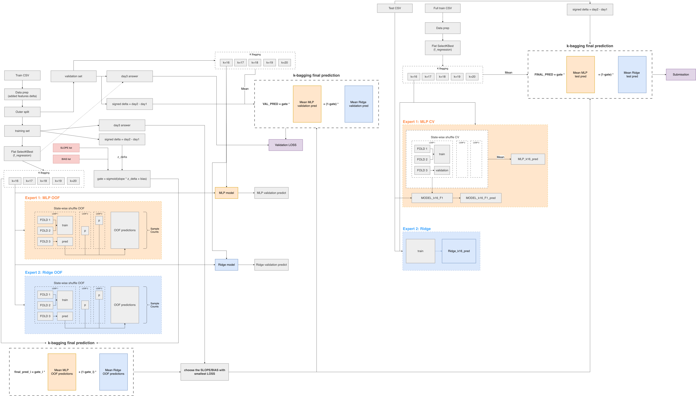

# kaggle_playground

練習訓練模型

## COVID PREDICTION

https://www.kaggle.com/competitions/ml2021spring-hw1/overview

- 有許多人的各種 features 包含 day1, day2, day3 的 COVID percentage
- 給定 day1, day2 的各種 features，訓練一個 model 預測 day3

tranining: covid.test.csv
public testing: covid.train.csv
上傳 kaggle 格式範例：sampleSubmission.csv

### 最佳結果

### 實驗過程
https://icob-bioinfo-jordan.notion.site/HW1-2-COVID-342c61e0591980b4aec0ea5c2c793771?source=copy_link

---

## HOUSE PRICES PREDICTION

https://www.kaggle.com/competitions/house-prices-advanced-regression-techniques/overview

train.csv - the training set
test.csv - the test set
data_description.txt - full description of each column, originally prepared by Dean De Cock but lightly edited to match the column names used here
sample_submission.csv - a benchmark submission from a linear regression on year and month of sale, lot square footage, and number of bedrooms
